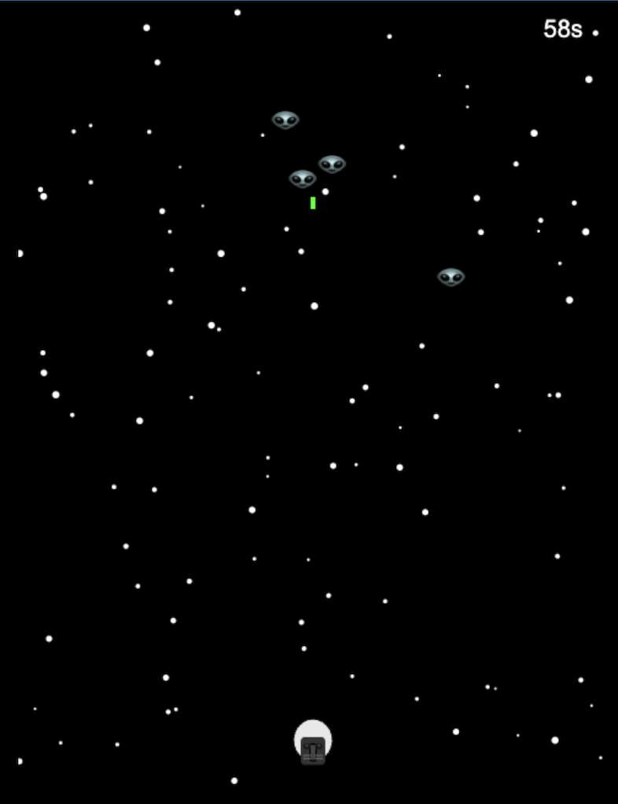
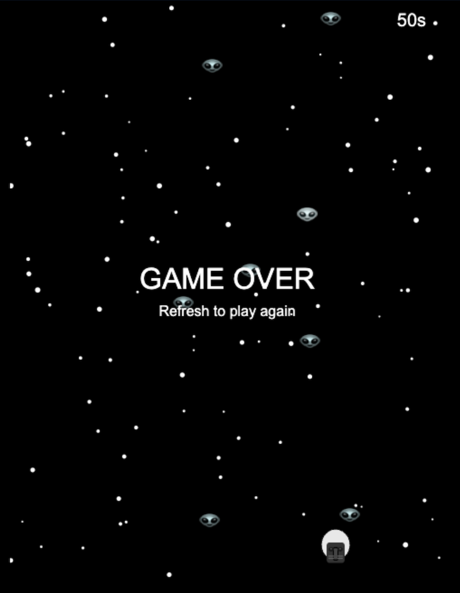

# Space Invaders

A classic Space Invaders game implemented in HTML5 Canvas and JavaScript featuring a Star Wars themed player character (Darth Vader helmet) defending against alien invaders.

## Game Description

This is a modern take on the classic Space Invaders arcade game. The player controls a spaceship (styled as Darth Vader) at the bottom of the screen and must shoot down waves of alien invaders that fall from the top. The game features:

- **Survival Mode**: Survive for 60 seconds to win
- **Dynamic Spawning**: Aliens spawn randomly from the top of the screen
- **Space Theme**: Star field background with space-themed graphics
- **Audio Feedback**: Text-to-speech "GAME OVER" announcement
- **Responsive Controls**: Smooth keyboard controls for movement and shooting

## How to Play

- **Arrow Keys** (←/→): Move your ship left and right
- **Spacebar**: Fire bullets at the invaders
- **Objective**: Survive for 60 seconds without letting invaders reach you
- **Game Over**: If an invader reaches your position, the game ends

## Game Screenshots

### Game in Action

*The game in action showing the player ship, alien invaders, bullets, and star field background*

### Game Over Screen

*Game over screen displayed when the player is defeated*

## Features

- **Retro Graphics**: Pixel-perfect rendering with modern SVG fallbacks
- **Smooth Animation**: 60 FPS gameplay with requestAnimationFrame
- **Visual Effects**: Twinkling stars background for space atmosphere
- **Timer System**: Real-time countdown showing remaining survival time
- **Collision Detection**: Precise hit detection between bullets and invaders
- **Progressive Difficulty**: Continuous spawning keeps the challenge engaging

## Technical Details

- Built with vanilla HTML5, CSS3, and JavaScript
- Canvas-based rendering for smooth graphics
- SVG graphics with bitmap fallbacks for maximum compatibility
- Responsive design that works on different screen sizes
- No external dependencies - runs entirely in the browser

## File Structure

```
space-invaders/
├── index.html      # Main HTML file
├── game.js         # Game logic and rendering
├── 1.png          # Gameplay screenshot
├── 2.png          # Game over screenshot
└── README.md      # This file
```

## Getting Started

1. Clone this repository
2. Open `index.html` in any modern web browser
3. Start playing immediately - no installation required!

## Browser Compatibility

This game works in all modern browsers that support:
- HTML5 Canvas
- ES6 JavaScript features
- Web Speech API (optional, for audio effects)

Tested on Chrome, Firefox, Safari, and Edge.

## Game Mechanics

- **Player Ship**: Moves horizontally along the bottom of the screen
- **Bullets**: Green projectiles fired upward at alien invaders
- **Invaders**: Green alien sprites that fall downward
- **Collision**: Bullets destroy invaders on contact
- **Win Condition**: Survive for 60 seconds
- **Lose Condition**: Any invader reaches the player's vertical position

## Development

The game is built with clean, readable JavaScript and follows modern web development practices. The code is well-commented and easy to modify for customization or learning purposes.

---

*Created as a tribute to the classic arcade game that started it all. May the Force be with you!*
